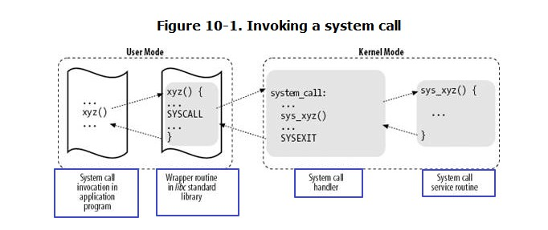

##10.1. POSIX APIs and System Calls
+ an API does not necessarily correspond to a specific system call
+ From the kernel designer's point of view, however, the distinction does matter because system calls belong to the kernel, while User Mode libraries don't.

##10.2. System Call Handler and Service Routines
+ in the 80 x 86 architecture a Linux system call can be invoked in two different ways. The net result of both methods, however, is a jump to **an assembly language function** called the *system call handler*.

+ To associate each system call number with its corresponding service routine, the kernel uses a system call dispatch table --- which is stored in the sys_call_table array

##10.3. Entering and Exiting a System Call
+ Native applications can invoke a system call in two different ways:

###10.3.1. Issuing a System Call via the int $0x80 Instruction
+ during kernel initialization,  trap_init( ) --- > set_system_gate(0x80, &system_call);
+ when a User Mode process issues an int $0x80 instruction, the CPU switches into Kernel Mode and starts executing instructions from the system_call address

####10.3.1.1. The system_call( ) function

####10.3.1.2. Exiting from the system call
+ When the system call service routine terminates, the system_call( ) function gets its return code from eax and stores it in the stack location

###10.3.2. Issuing a System Call via the sysenter Instruction
+ The sysenter instruction, dubbed in Intel documentation as "Fast System Call," provides a faster way to switch from User Mode to Kernel Mode.

####10.3.2.1. The sysenter instruction
+ makes use of three special registers

####10.3.2.2. The vsyscall page
+ in the initialization phase the sysenter_setup( ) function builds a page frame called *vsyscall page*

####10.3.2.3. Entering the system call
+ sysenter instruction ---> step1 ~ step4

####10.3.2.4. Exiting from the system call

####10.3.2.5. The sysexit instruction
+ it allows a fast switch from Kernel Mode to User Mode

####10.3.2.6. The SYSENTER_RETURN code
+ simply restores the original contents of the ebp, edx, and ecx registers saved in the User Mode stack, and returns the control to the wrapper routine in the standard library

##10.4. Parameter Passing
+ system call parameters are written in the CPU registers before issuing the system call. The kernel then copies the parameters stored in the CPU registers onto the Kernel Mode stack before invoking the system call service routine, because the latter is an ordinary C function.
+ large parameters that cannot be stored in a 32-bit register must be **passed by reference**
+ The return value of a service routine must be written into the eax register. This is automatically done by the C compiler when a return n; instruction is executed

###10.4.1. Verifying the Parameters

###10.4.2. Accessing the Process Address Space
+ System call service routines often need to read or write data contained in the process's address space.

###10.4.3. Dynamic Address Checking: The Fix-up Code
+ the linear addresses passed as parameters still might not belong to the process address space. In this case, a Page Fault exception will occur when the kernel tries to use any of such bad addresses.

###10.4.4. The Exception Tables
+ some kernle funcs include a programming bug

###10.4.5. Generating the Exception Tables and the Fixup Code
+ a system call service routine attempts to read or write into a memory area whose address has been passed as a system call parameter, but that address does not belong to the process address space.
