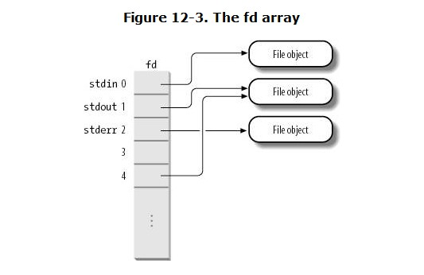
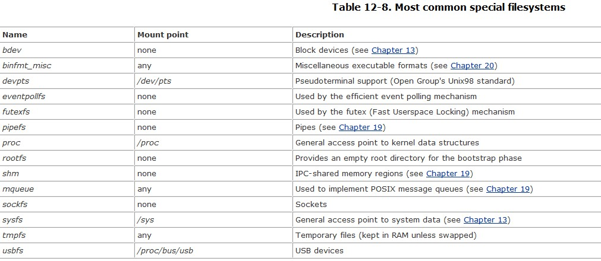

##12.1. The Role of the Virtual Filesystem (VFS)
+ its main strength is to providing a common if to several kinds of Filesystem.
+ Filesystems supported by the VFS may be grouped into three main classes:

| class      | note                                          |
| ---------- | --------------------------------------------- |
| Disk-based | manage memory space available in a local disk |
| Network    | allow easy access to files included in filesystems belonging to other networked computers|
| Special    | do not manage disk space, either locally or remotely                                              |

###12.1.1. The Common File Model
+ each specific filesystem implementation must translate its physical organization into the VFS's common file model.---> 每一种文件系统都必须将自己的物理组织方式转换成VFS通用文件模型。
+ The common file model consists of the following object types:

| type                  | note                                               |
| --------------------- | -------------------------------------------------- |
| The superblock object | Stores information concerning a mounted filesystem |
| The inode object      | Stores general information about a specific file                                                   |
| The file object       | Stores information about the interaction between an open file and a process                                                   |
| The dentry object     | Stores information about the linking of a directory entry with the corresponding file                                                   |

+ *a disk cache* is a software mechanism that allows the kernel to keep in RAM some information that is normally stored on a disk
+ page cache refer to ch15

###12.1.2. System Calls Handled by the VFS

##12.2. VFS Data Structures

###12.2.1. Superblock Objects
+ super_block structure
+ All superblock objects are linked in a circular doubly linked list, first element of this list is represented by the *super_blocks* variable
+ Linux minimizes this problem by periodically copying all dirty superblocks to disk

###12.2.2. Inode Objects
+ All information needed by the filesystem to handle a file is included in a data structure called an inode
+ An inode object in memory consists of an *inode* structure
+ Each inode object always appears in one of the following circular doubly linked lists
  + The list of valid unused inodes, typically those mirroring valid disk inodes and not currently used by any process.
  + The list of in-use inodes, that is, those mirroring valid disk inodes and used by some process.
  + The list of dirty inodes.
+  each inode object is also included in a per-filesystem doubly linked circular list headed at the *s_inodes* field of the superblock object
+  the inode objects are also included in a hash table named *inode_hashtable*.

###12.2.3. File Objects
+ A file object describes how a process interacts with a file it has opened.
+ Notice that file objects have no corresponding image on disk, and hence no "dirty" field is included in the file structure to specify that the file object has been modified. ---> 文件对象在磁盘上不存在相关的映像。
+ The main information stored in a file object is the *file pointer*
+ the file pointer must be kept in the file object rather than the inode object. ---> several process may concurrently access the same file.
+ File objects are allocated through a slab cache named *filp*

###12.2.4. dentry Objects
+ Notice that dentry objects have *no corresponding image* on disk, and hence no field is included in the dentry structure to specify that the object has been modified.
+ states of dentry object:

| state    | meaning                                                                    |
| -------- | -------------------------------------------------------------------------- |
| Free     | The dentry object contains no valid information and is not used by the VFS |
| Unused   | The dentry object is not currently used by the kernel.                     |
| In use   | The dentry object is currently used by the kernel.                         |
| Negative | The inode associated with the dentry does not exist                        |

###12.2.5. The dentry Cache
+ To maximize efficiency in handling dentries, Linux uses a dentry cache, which consists of two kinds of data structures:
  + A set of dentry objects in the in-use, unused, or negative state.
  + A hash table to derive the dentry object

###12.2.6. Files Associated with a Process
+ each process has its own current working directory and its own root directory
+ The *fd* field points to an array of pointers to file objects



##12.3. Filesystem Types

###12.3.1. Special Filesystems

+ he kernel assigns to each mounted special filesystem a fictitious block device that has the value 0 as major number and an arbitrary value as a minor number.

###12.3.2. Filesystem Type Registration
+ The VFS must keep track of all filesystem types whose code is currently included in the kernel.
+ All filesystem-type objects are inserted into a singly linked list.
+ During system initialization, the *register_filesystem( )* function is invoked for every filesystem specified at compile time; the function inserts the corresponding file_system_type object into the filesystem-type list

##12.4. Filesystem Handling

###12.4.1. Namespaces
+  every process might have its own tree of mounted filesystemsthe so-called *namespace* of the process.

###12.4.2. Filesystem Mounting
+  it is possible to mount the same filesystem several times in Linux
+  there is *only one superblock object* for all of them, no matter of how many times it has been mounted
+  The vfsmount data structures are kept in several doubly linked circular lists:
  +  A hash table indexed by the address of the vfsmount descriptor of the parent filesystem and the address of the dentry object of the mount point directory.
  +  For each namespace, a circular doubly linked list including all mounted filesystem descriptors belonging to the namespace.
  +  For each mounted filesystem, a circular doubly linked list including all child mounted filesystems.

###12.4.3. Mounting a Generic Filesystem
+ The mount( ) system call is used to mount a generic filesystem;

####12.4.3.1. The do_kern_mount( ) function
+ The *core* of the mount operation is the do_kern_mount( ) function, which checks the filesystem type flags to determine how the mount operation is to be done.

####12.4.3.2. Allocating a superblock object
```
struct super_block * ext2_get_sb(struct file_system_type *type, int flags, const char *dev_name, void *data)
{
    return get_sb_bdev(type, flags, dev_name, data, ext2_fill_super);
}
```

###12.4.4. Mounting the Root Filesystem
+ Mounting the root filesystem is a two-stage procedure, shown in the following list:
  + The kernel mounts the special rootfs filesystem, which simply provides an empty directory that serves as initial mount point.
  + The kernel mounts the real root filesystem over the empty directory.

####12.4.4.1. Phase 1: Mounting the rootfs filesystem
+ The first stage is performed by the init_rootfs( ) and init_mount_tree( ) functions

####12.4.4.2. Phase 2: Mounting the real root filesystem
+ near the end of the system initialization
+ Notice that the rootfs special filesystem is not unmounted: it is only hidden under the disk-based root filesystem.

###12.4.5. Unmounting a Filesystem
+ The umount( ) system call is used to unmount a filesystem

##12.5. Pathname Lookup
+ In this section, we illustrate how the VFS performs a pathname lookup , that is, how it **derives an inode** from the corresponding file pathname.
+ following Unix and VFS filesystem features must be taken into consideration:
  + The access rights of each directory must be checked to verify whether the process is allowed to read the directory's content.
  + A filename can be a symbolic link that corresponds to an arbitrary pathname;
  + Symbolic links may induce circular references;
  + A filename can be the mount point of a mounted filesystem.
  + Pathname lookup has to be done inside the namespace of the process that issued the system call.

+ the core of the pathname lookup operation, namely the link_path_walk( ) function.

###12.5.1. Standard Pathname Lookup ---> too much details

###12.5.2. Parent Pathname Lookup
+ In many cases, the real target of a lookup operation is not the last component of the pathname, but the next-to-last one.

###12.5.3. Lookup of Symbolic Links
+ This is how the code basically works: once the link_path_walk( ) function retrieves the dentry object associated with a component of the pathname, it checks whether the corresponding inode object has a custom follow_link method (see step *5l* and step *14* in the section "Standard Pathname Lookup"). If so, the inode is a symbolic link that must be interpreted before proceeding with the lookup operation of the original pathname.


##12.6. Implementations of VFS System Calls

###12.6.1. The open( ) System Call
+ the operation of the sys_open( ) function

###12.6.2. The read( ) and write( ) System Calls

###12.6.3. The close( ) System Call

##12.7. File Locking
+ When a file can be accessed by more than one process, a synchronization problem occurs.
