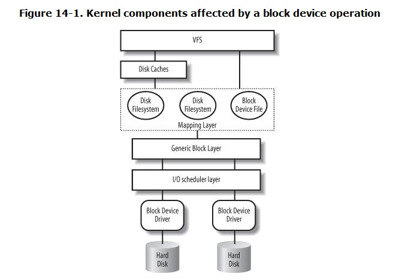
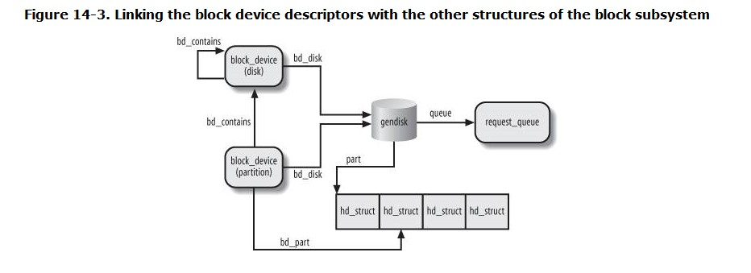

# Chapter 14. Block Device Drivers
+ outline the general software architecture

## 14.1. Block Devices Handling

### 14.1.1. Sectors
+ Each data transfer operation for a block device acts on a group of adjacent bytes called a sector.
+ In most disk devices, the size of a sector is 512 bytes

### 14.1.2. Blocks
+ the block is the basic unit of data transfer for the VFS and for the filesystems
+ In Linux, the block size must be a power of 2 and cannot be larger than a page frame
+ The block size is not specific to a block device
+ Each block requires its own block buffer, which is a RAM memory area used by the kernel to store the block's content.
+ Each buffer has a "buffer head" descriptor of type buffer_head. This descriptor contains all the information needed by the kernel to know how to handle the buffer; thus, *before operating on each buffer*, the kernel checks its buffer head.

| field     | meaning                                                                             |
| --------- | ----------------------------------------------------------------------------------- |
| b_page    | stores the page descriptor address of the page frame that includes the block buffer |
| b_data    | depends whether page frame lies in high Memory                                      |
| b_blocknr | stores the logical block number                                                     |
| b_bdev    | identifies the block device that is using the buffer head                           |

### 14.1.3. Segments
+ The block device driver simply triggers the data transfer by sending suitable commands to the disk controller;
+ The data transferred by a single DMA operation must belong to sectors that are *adjacent on disk*.
+ Recent disk controllers, however, may also support the so-called *scatter-gather DMA transfers* : in each such operation, the data can be transferred from or to several *noncontiguous* memory areas.
+ For each scatter-gather DMA transfer, the block device driver must send to the disk controller:
  + The initial disk sector number and the total number of sectors to be transferred --- 初始化的扇区号 + 总扇区数
  + A list of descriptors of memory areas, each of which consists of an address and a length. --- 非连续内存区列表，每项包含地址和长度
+ To make use of scatter-gather DMA operations, block device drivers must handle the data in units called *segments* . A segment is simply a memory page or a portion of a memory page that includes the data of some adjacent disk sectors. Thus, a scatter-gather DMA operation may involve several segments at once. --- 包含硬盘上连续扇区的内存页或部分内存页集合
+ the generic block layer can merge different segments --->  *physical segment*
+ another merge operation is allowed on architectures that handle the mapping between bus addresses and physical addresses ---> *hardware segment*

## 14.2. The Generic Block Layer

### 14.2.1. The Bio Structure
+ core data structure --- bio
+ Each segment in a bio is represented by a bio_vec data structure

### 14.2.2. Representing Disks and Disk Partitions
+ A disk is a logical block device that is handled by the generic block layer
+ Hard disks are commonly split into logical partitions .
+ If a disk is split in partitions, their layout is kept in an array of *hd_struct* structures whose address is stored in the part field of the *gendisk* object.

### 14.2.3. Submitting a Request
+ The first step consists in executing the bio_alloc( ) function to allocate a new bio descriptor. Then, the kernel initializes the bio descriptor by setting a few fields:

## 14.3. The I/O Scheduler
+ kernel tries, whenever possible, to cluster several sectors and handle them as a whole, thus reducing the average number of head movements. --- thus reducing time-consuming
+ When a new block data transfer is requested, the kernel checks whether it can be satisfied by slightly enlarging a previous request that is still waiting --- without further seek operations
+ To keep the block device driver from being suspended, each I/O operation is processed asynchronously.
+ Each block device driver maintains its own request queue, which contains the list of pending requests for the device. If the disk controller is handling several disks, there is usually one request queue for each physical block device. I/O scheduling is performed separately on each request queue, thus increasing disk performance. --- 每个驱动维护自己的请求队列（包含所有对设备的挂载请求列表）。如果硬盘控制器同正在处理多个逻辑设备，每个物理块设备通常只有一个请求队列。 I/O调度分别作用于每个请求队列，因此可以提高逻辑块设备的性能。

### 14.3.1. Request Queue Descriptors
+ Each request queue is represented by means of a large *request_queue* data structure

### 14.3.2. Request Descriptors
+ Each pending request for a block device is represented by a *request descriptor*
+ the generic block layer creates a request including just one bio. Later, the I/O scheduler may "extend" the request

#### 14.3.2.1. Managing the allocation of request descriptors
+ To cope with this kind of situation, each request_queue descriptor includes a request_list data structure --- 瓶颈：高负载情况下，有限的可用动态内存。

#### 14.3.2.2. Avoiding request queue congestion
+ Each request queue has a maximum number of allowed pending requests
+  if the number of pending requests for a given direction exceeds the value stored in the nr_congestion_on field of the request descriptor (by default, 113), the kernel regards the queue as congested and tries to slow down the creation rate of the new requests.--- 如果对应方向的请求（读写）数超过了最大值，内核认为队列阻塞，并且减缓新请求的生成。

### 14.3.3. Activating the Block Device Driver
+ it's expedient to delay activation of the block device driver in order to increase the chances of clustering requests for adjacent blocks. --- 聚集对相邻块访问的请求（延迟激活驱动）
+ The *delay* is accomplished through a technique known as *device plugging and unplugging* --- 设备激活和去激活

### 14.3.4. I/O Scheduling Algorithms
+  I/O schedulers are also called *elevators*
+  Linux 2.6 offers four different types of I/O schedulers or elevators called "Anticipatory," "Deadline," "CFQ (Complete Fairness Queueing)," and "Noop (No Operation)." --- 内核支持的四种I/O调度器
+  the system administrator can change at runtime the I/O scheduler for a specific block device.
+  The I/O scheduler algorithm used in a request queue is represented by an elevator object of type *elevator_t*; its address is stored in the *elevator* field of the request queue descriptor.
+  all algorithms make use of a *dispatch queue*，The dispatch queue is actually the request queue rooted at the queue_head field of the request queue descriptor.
+  the next request to be serviced by the device driver is always the first element in the dispatch queue.

#### 14.3.4.1. The "Noop" elevator
+ This is the simplest I/O scheduling algorithm.

#### 14.3.4.2. The "CFQ" elevator
+ The main goal of the "Complete Fairness Queueing" elevator is ensuring a fair allocation of the disk I/O bandwidth among all the processes that trigger the I/O requests. To achieve this result, the elevator makes use of a large number of sorted queues（64 by default）

#### 14.3.4.3. The "Deadline" elevator
+ the "Deadline" elevator makes use of four queues.
+ A request deadline is essentially an expire timer that starts ticking when the request is passed to the elevator.

#### 14.3.4.4. The "Anticipatory" elevator
+ the most sophisticated I/O scheduler algorithm offered by Linux
+ an *evolution* of the "Deadline" elevator

### 14.3.5. Issuing a Request to the I/O Scheduler
+ implemented by the _ _make_request( ) function

#### 14.3.5.1. The blk_queue_bounce( ) function
+ The blk_queue_bounce( ) function looks at the flags in q->bounce_gfp and at the threshold in q->bounce_pfn to determine whether buffer bouncing might be required.
+ Block device drivers prefer to directly allocate the DMA buffers in the **ZONE_DMA** memory zone

## 14.4. Block Device Drivers
+ lowest component of the Linux block subsystem
+ get requests from I/O scheduler, and do whatever is required to process them.

### 14.4.1. Block Devices
+ All block device descriptors are inserted in a global list, whose head is represented by the *all_bdevs* variable

#### 14.4.1.1. Accessing a block device

### 14.4.2. Device Driver Registration and Initialization
+ essential steps involved in setting up a new device driver for a block device

#### 14.4.2.1. Defining a custom driver descriptor
+ The device driver must reserve a major number for its own purposes
+ no link is established between the reserved *major number* and the *data structures* of the driver. The only visible effect of register_blkdev( ) is to include a new item in the list of registered major numbers in the */proc/devices* special file.

#### 14.4.2.2. Initializing the custom descriptor

#### 14.4.2.3. Initializing the gendisk descriptor
+ the driver initializes some fields of the gendisk descriptor:

#### 14.4.2.4. Initializing the table of block device methods
+ The *fops* field of the gendisk descriptor is initialized

#### 14.4.2.5. Allocating and initializing a request queue

#### 14.4.2.6. Setting up the interrupt handler
+ the driver needs to register the IRQ line for the device

#### 14.4.2.7. Registering the disk
+ the last step of the initialization phase consists of "registering" and activating the disk
+ Once add_disk( ) returns, the device driver is actively working.

### 14.4.3. The Strategy Routine
+ The strategy routine is a function or a group of functions of the block device driver that interacts with the hardware block device to satisfy the requests collected in the dispatch queue. --- 和dispatch queue中的请求互动。
+ the strategy routine is usually started after inserting a new request in an empty request queue. Once activated, the block device driver should handle all requests in the queue and terminate when the queue is empty.---策略服务程序通常在空的请求队列中插入新的请求时开启。处理完请求后，在队列空时终止服务。

+ most block device drivers adopt the following strategy:
  + The strategy routine starts a data transfer for the first request in the queue and sets up the block device controller so that it raises an interrupt when the data transfer completes. Then the strategy routine terminates.---对队列中的第一个请求开启一个数据传输，设置块设备控制器（完成数据传输时，控制器将产生中断），然后策略程序终止。
  + When the disk controller raises the interrupt, the interrupt handler invokes the strategy routine again (often directly, sometimes by activating a work queue). The strategy routine either starts another data transfer for the current request or, if all the chunks of data of the request have been transferred, removes the request from the dispatch queue and starts processing the next request.---当硬盘控制器产生中断，中断处理程序再次调用策略程序。策略程序要么对当前的请求启动另一个数据传输，要么从分发队列中移除对应请求（所有数据块已完成传输），接着处理下一个请求。

### 14.4.4. The Interrupt Handler
+ The interrupt handler of a block device driver is activated when a DMA transfer terminates. It should check whether all chunks of data in the request have been transferred. If so, the interrupt handler invokes the strategy routine to process the next request in the dispatch queue. Otherwise, the interrupt handler updates the field of the request descriptor and invokes the strategy routine to process the data transfer yet to be performed.---当一个DMA传输终止时，块设备驱动的中断服务程序被激活。当所有数据块完成传输时，中断调用策略程序处理下一个请求，否则更新当前的请求描述符，并继续处理当前的数据传输。

## 14.5. Opening a Block Device File
+ conclude this chapter by describing the steps performed by the VFS when opening a block device file.
