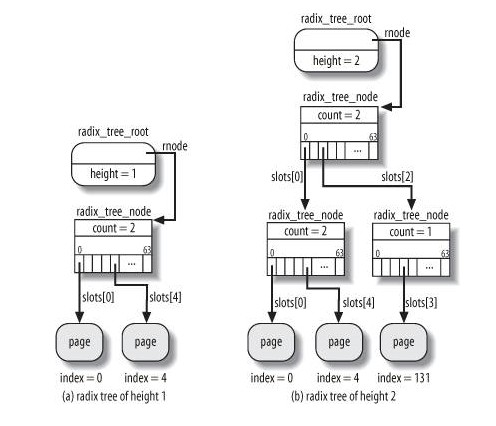

# Chapter 15. The Page Cache
+ page cache , which is a disk cache working on whole pages of data.

## 15.1. The Page Cache
+ page cache type
  + Pages containing data of regular files
  + Pages containing directories
  + Pages containing data directly read from block device files
  + Pages containing data of User Mode processes that have been swapped out on disk
  + Pages belonging to files of special filesystems(shm for IPC)

+ each page included in the page cache contains data belonging to some file. This file or more precisely the file's inodeis called the page's *owner*.
+ several *database applications* make use of the *O_DIRECT* flag so that they can use their own disk caching algorithm
+ a page in the page cache is identified by an owner and by an index within the owner's data---可以由所有者和位于所有者数据内的索引来识别页缓存内的页。

### 15.1.1. The address_space Object
+ a data structure embedded in the inode object that owns the page

### 15.1.2. The Radix Tree
+ In order to perform page cache lookup efficiently, Linux 2.6 makes use of a large set of search trees, one for each address_space object.

### 15.1.3. Page Cache Handling Functions

#### 15.1.3.1. Finding a page
+ find_get_page() and some similar functions

#### 15.1.3.2. Adding a page
+ add_to_page_cache()

#### 15.1.3.3. Removing a page
+ remove_from_page_cache()

#### 15.1.3.4. Updating a page
+ read_cache_page()

### 15.1.4. The Tags of the Radix Tree
+ to allow a *quick search* of dirty pages, intermediate node in the radix tree contains a dirty tag for each child node
+ each node includes two arrays of 64 bits in the tags field. The tags[0] array (PAGECACHE_TAG_DIRTY) is the dirty tag, while the tags[1] (PAGECACHE_TAG_WRITEBACK) array is the writeback tag.

## 15.2. Storing Blocks in the Page Cache
+ a *buffer page* is a page of data associated with additional descriptors called "buffer heads"

### 15.2.1. Block Buffers and Buffer Heads
+ buffer_head，needed by the kernel to know how to handle the block

### 15.2.2. Managing the Buffer Heads

### 15.2.3. Buffer Pages
+ two common cases in which the kernel creates buffer pages:
  + When reading or writing pages of a file that are not stored in contiguous disk blocks
  + When accessing a single disk block

### 15.2.4. Allocating Block Device Buffer Pages
+ In order to add a block device buffer page to the page cache, the kernel invokes the grow_buffers( ) function

### 15.2.5. Releasing Block Device Buffer Pages
+ To release buffer pages, the kernel invokes the try_to_release_page( ) function

### 15.2.6. Searching Blocks in the Page Cache
+ Searching the page cache is a three stage process:
  + Get a pointer to the address_space object of the block device containing the block
  + Get the block size of the device (bdev->bd_block_size), and compute the index of the page that contains the block.
  + Searches for the buffer page in the radix tree of the block device.

#### 15.2.6.1. The _ _find_get_block( ) function

#### 15.2.6.2. The _ _getblk( ) function

#### 15.2.6.3. The _ _bread( ) function

### 15.2.7. Submitting Buffer Heads to the Generic Block Layer
+ to start an I/O data transfer on one or more buffers described by their buffer heads.

#### 15.2.7.1. The submit_bh( ) function

#### 15.2.7.2. The ll_rw_block( ) function

## 15.3. Writing Dirty Pages to Disk
+ deferred writes --- 延迟写回
+ dirty pages are flushed (written) to disk under the following conditions:
  + The page cache gets too full and more pages are needed, or the number of dirty pages becomes too large.
  + Too much time has elapsed since a page has stayed dirty.
  + A process requests all pending changes of a block device or of a particular file to be flushed;

### 15.3.1. The pdflush Kernel Threads
+ Births and deaths are governed by the following rules:
  + There must be at least two pdflush kernel threads and at most eight.
  + If there were no idle pdflush during the last second, a new pdflush should be created.
  + If more than one second elapsed since the last pdflush became idle, a pdflush should be removed.

+ In particular, pdflush usually executes one of the following callback functions:
  + background_writeout( ): ---> looking for dirty pages to be flushed
  + wb_kupdate( ): ---> checks that no page in the page cache remains dirty for too long

### 15.3.2. Looking for Dirty Pages To Be Flushed
+ Linux adopts a sophisticated mechanism that splits the page cache scanning in several runs of execution. ---> 避免单次扫描整个缓存导致CPU和硬盘长时间忙碌，影响系统性能

### 15.3.3. Retrieving Old Dirty Pages
+ if a page remains dirty for a predefined amount of time, the kernel explicitly starts an I/O data transfer that writes its contents to disk. ---> 内核避免一些dirty page长时间没有回写。
+ The job of retrieving old dirty pages is delegated to a pdflush kernel thread that is periodically woken up. ---> 周期性调用
+  page_writeback_init( ) function sets up the wb_timer dynamic timer

## 15.4. The sync( ), fsync( ), and fdatasync( ) System Calls
+ sync ---> allow a process to flush all dirty buffers to disk
+ fsync ---> allow a process to flush all blocks *belong to a specific open file* to disk
+ fdatasync ---> similar to fsync, doesn't flush inode block of the file. ---> 不回写文件的inode块。
