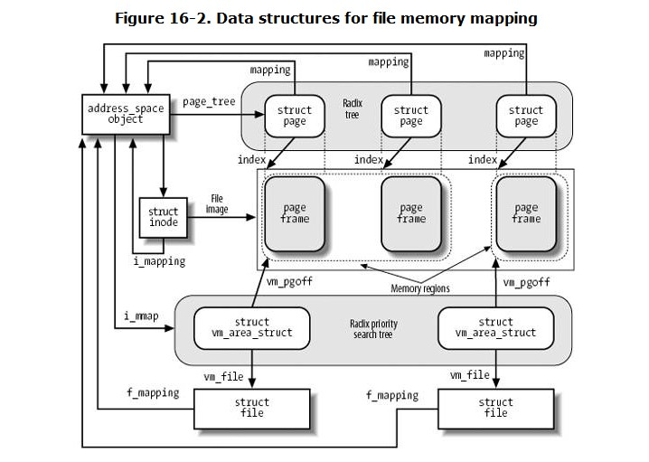

# Chapter 16. Accessing Files
+ There are many different ways to access a file. In this chapter we will consider the following cases:

| type                | explains                                                                |
| ------------------- | ----------------------------------------------------------------------- |
| Canonical mode      | accessed by means of the read( ) and write( ) system calls.             |
| Synchronous mode    | opened with the O_SYNC flag or set by the fcntl( ) system call.         |
| Memory mapping mode | issues an mmap( ) system call to map the file into memory               |
| Direct I/O mode     | transfers data directly from the User Mode address space to disk        |
| Asynchronous mode   | through a group of POSIX APIs or by means of Linux-specific system call |

## 16.1. Reading and Writing a File
+ For most filesystems, reading a page of data from a file is just a matter of finding what blocks on disk contain the requested data.---硬盘上那个块包含请求的数据。
+ Write operations on disk-based files are slightly more complicated to handle, because the file size could increase, and therefore the kernel might allocate some physical blocks on the disk.---写操作稍微复杂一点，因为文件可能增大。

### 16.1.1. Reading from a File
+ generic_file_read( ) function

#### 16.1.1.1. The readpage method for regular files
+ The readpage method of the address_space object stores the address of the function that effectively activates the I/O data transfer from the physical disk to the page cache.---保存激活I/O数据传输函数的地址。

#### 16.1.1.2. The readpage method for block device files
+ implemented by the blkdev_readpage( ) function
+ the second parameter points to a function that translates the file block number relative to the beginning of the file into a logical block number relative to the beginning of the block device.---将文件块号转化为逻辑块号。

### 16.1.2. Read-Ahead of Files
+ Read-ahead consists of reading several adjacent pages of data of a regular file or block device file before they are actually requested.---在实际的请求来临前已经预读。
+ read-ahead is of no use when an application performs random accesses to files;---当应用程序随机访问文件时，预读将不适用。
+ Read-ahead of files requires a sophisticated algorithm for several reasons:
+ The kernel considers a file access as sequential with respect to the previous file access if the first page requested is the page following the last page requested in the previous access.
---如果请求的第一个页面是在先前访问中请求的最后一页之后的页面，则内核将文件访问视为与先前文件访问相关的顺序。
+ the read-ahead algorithm makes use of two sets of pages:
  + current window
  + ahead window
+ main data structure used by the read-ahead algorithm is the *file_ra_state* descriptor

+ When is the read-ahead algorithm executed? This happens in the following cases:

#### 16.1.2.1. The page_cache_readahead( ) function
+ takes care of all read-ahead operations that are not explicitly triggered by ad-hoc system calls.

#### 16.1.2.2. The handle_ra_miss( ) function
+ In some cases, the kernel must correct the read-ahead parameters, because the read-ahead strategy does not seem very effective. ---纠正预读参数（预读策略效率较低时）

### 16.1.3. Writing to a File
+ Many filesystems (including Ext2 or JFS ) implement the write method of the file object by means of the *generic_file_write( )* function

#### 16.1.3.1. The prepare_write and commit_write methods for regular files
+ The prepare_write and commit_write methods of the address_space object specialize the generic write operation implemented by generic_file_write( ) for regular files and block device files.
+ The block_prepare_write( ) function takes care of preparing the buffers and the buffer heads of the file's page

#### 16.1.3.2. The prepare_write and commit_write methods for block device files

### 16.1.4. Writing Dirty Pages to Disk
+ Many non-journaling filesystems rely on the mpage_writepage( ) function rather than on the custom writepage method. This can improve performance because the mpage_writepage( ) function tries to submit the I/O transfers by collecting as many pages as possible in the same bio descriptor; in turn, this allows the block device drivers to exploit the *scatter-gather DMA* capabilities of the modern hard disk controllers.

## 16.2. Memory Mapping
+ an access to a byte within a page of the memory region is translated by the kernel into an operation on the corresponding byte of the file. --- 内核将对存储器区域的页面内的字节的访问转换为对文件的相应字节的操作。

+ two kinds of mem mapping:
+ shared --- changes are visible to all other processes that mapping the same file
+ private --- to be used when process create the mapping just to read the file, not to write it.

### 16.2.1. Memory Mapping Data Structures

+ The core of memory mapping implementation is delegated to a file object's method named *mmap*.

### 16.2.2. Creating a Memory Mapping
+ To create a new memory mapping, a process issues an mmap( ) system call
+ The mmap( ) system call returns the linear address of the first location in the new memory region.

### 16.2.3. Destroying a Memory Mapping
+ there is no need to flush to disk the contents of the pages included in a writable shared memory

### 16.2.4. Demand Paging for Memory Mapping
+ page frames are not assigned to a memory mapping right after it has been created, but at the *last possible moment*

### 16.2.5. Flushing Dirty Memory Mapping Pages to Disk
+ The *msync( )* system call can be used by a process to flush to disk dirty pages belonging to a shared memory mapping.

### 16.2.6. Non-Linear Memory Mappings
+ each memory page maps a random (arbitrary) page of file's data.

## 16.3. Direct I/O Transfers
+ Because block hardware devices must be handled through interrupts and Direct Memory Access (DMA), and this can be done only in Kernel Mode, some sort of kernel support is definitely required to implement self-caching applications.---块硬件设备必须通过中断或DMA方式进行处理，而且只能在内核模式进行
+ Linux offers a simple way to bypass the page cache: direct I/O transfers. In each I/O direct transfer, the kernel programs the disk controller to transfer the data directly from/to pages belonging to the User Mode address space of a self-caching application.---linux通过直接内存传输来绕开页表缓存。
+ Disk caches are owned by the kernel, cannot be swapped out, and are visible to all processes in Kernel Mode.---由内核所有的硬盘缓存不能被换出，并且对所有内核模式下的进程都可见。

+ direct I/O transfers should move data within *pages*---直接I/O传输在页内移动数据。
+ pages not swapped out while the data transfer is in progress --- 正在进行数据传输的页不能被换出

+ When a self-caching application wishes to directly access a file, it opens the file specifying the O_DIRECT flag --- 自缓存应用在访问文件时，指定文件打开标志为*O_DIRECT*,并且可以对已经打开的文件动态设置此标志。
+ In most cases, the direct_IO method is a wrapper for the *_ _blockdev_direct_IO( )* function.

## 16.4. Asynchronous I/O
+ The POSIX 1003.1 standard defines a set of library functions for accessing the files in an *asynchronous* way. "Asynchronous" essentially means that when a User Mode process invokes a library function to read or write a file, the function terminates as soon as the read or write operation has been enqueued, possibly even before the actual I/O data transfer takes place. The calling process can thus continue its execution while the data is being transferred.---支持异步IO的库函数在读写操作已经排队后就终止了。实际的数据传输可能在之后发生。这样调用进程可以在数据传输的同时继续执行。
+ The application can later check the status of the outstanding I/O operation by invoking *aio_error( )*, which returns EINPROGRESS if the data transfer is still in progress, 0 if it is successfully completed, or an error code in case of failure.---应用程序可以调用aio_error来确定数据传输的结果，用于判断后续的执行逻辑。

### 16.4.1. Asynchronous I/O in Linux 2.6
+ this "poor man's" version of the POSIX functions is significantly slower than a version that uses a kernel-level implementation of asynchronous I/O. --- POSIX异步IO库函数相比内核级别的异步IO慢得多

#### 16.4.1.1. The asynchronous I/O context
+ If a User Mode process wants to make use of the io_submit( ) system call to start an asynchronous I/O operation, it must create beforehand an asynchronous I/O context.---在使用系统调用前，先分配异步IO上下文（用于追踪异步IO执行的过程信息）
+ the AIO ring. --- 核心数据结构
  + The AIO ring is a memory buffer in the address space of the User Mode process that is also accessible by all processes in Kernel Mode. --- 进程地址空间内的内存缓冲区
+ The AIO ring is essentially a circular buffer where the kernel writes the completion reports of the outstanding asynchronous I/O operations. --- AIO ring其实是一个环形缓冲区，内核将异步IO操作的完成状态写入该区域。

#### 16.4.1.2. Submitting the asynchronous I/O operations
+ To start some asynchronous I/O operations, the application invokes the io_submit( ) system call.
