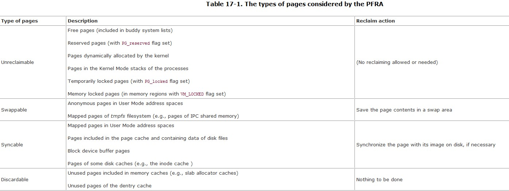
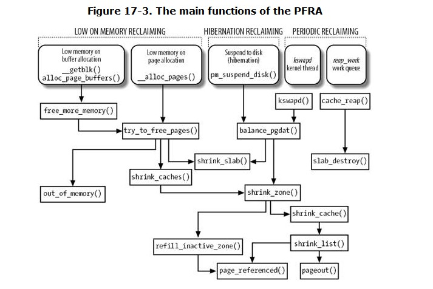

# Chapter 17. Page Frame Reclaiming

## 17.1. The Page Frame Reclaiming Algorithm
+ page frame reclaiming must be performed before all the free memory has been used up

### 17.1.1. Selecting a Target Page
+ the page frames selected by the PFRA must be non-free , that is, they must not be already included in one of the free_area arrays used by the buddy system

+ the tmpfs special filesystem is used by the IPC shared memory mechanism.

### 17.1.2. Design of the PFRA
+ a few general rules adopted by the PFRA

| rules                                             | exp                                                           |
| ------------------------------------------------- | ------------------------------------------------------------- |
| Free the "harmless" pages first                   | Pages  not referenced by any process                          |
| Make all pages of a User Mode process reclaimable | able to steal any page of a User Mode process                 |
| Reclaim a shared page frame                       | by unmapping at once all page table entries that reference it |
| Reclaim "unused" pages only                       | uses LRU alg to classify pages as in-use and unuse            |

## 17.2. Reverse Mapping
+ one obj of PFRA: free a shared page frame
+ linux2.6 is able to locate quickly all the page table entries that point to the same page frame. --- 2.6内核能快速定位指向相同页框的所有页表的入口，一种被称为反向映射的活动。

### 17.2.1. Reverse Mapping for Anonymous Pages
+ Anonymous pages are often shared among several processes. The most common case occurs when forking a new process

#### 17.2.1.1. The try_to_unmap_anon( ) function

#### 17.2.1.2. The try_to_unmap_one( ) function

### 17.2.2. Reverse Mapping for Mapped Pages
+ As with anonymous pages, object-based reverse mapping for mapped pages is based on a simple idea: it is always possible to retrieve the Page Table entries that refer to a given page frame by accessing the descriptors of the memory regions that include the corresponding mapped pages. --- 通过访问包含相关映射页面的内存区域的描述符来获取给定页框的页表地址入口。
+ Linux 2.6 relies on special search trees, called "priority search trees ,"（*PST*） to quickly locate all the memory regions that refer to the same page frame. --- 通过优先级搜索树来快速定位引用形同页框的所有内存区域。

#### 17.2.2.1. The priority search tree
+ a node of a PST is represented by a *prio_tree_node* data structure

### 17.2.2.2. The try_to_unmap_file( ) function
+ invoked by *try_to_unmap( )* to perform the reverse mapping of mapped pages

## 17.3. Implementing the PFRA
+ page frame reclaiming is performed on essentially three occasions:

| occasions                | exp                                                                         |
| ------------------------ | --------------------------------------------------------------------------- |
| Low on memory reclaiming | kernel detects a "low on memory"                                            |
| Hibernation reclaiming   | kernel must free memory because it is entering in the suspend-to-disk state |
| Periodic reclaiming      | A kernel thread is activated periodically to perform memory reclaiming      |

### 17.3.1. The Least Recently Used (LRU) Lists
+ All pages belonging to the User Mode address space of processes or to the page cache are grouped into two lists called the active list and the inactive list ; --- 所有的页被组织成两个列表：活动列表和非活动列表。
+ The former list tends to include the pages that have been accessed recently, while the latter tends to include the pages that have not been accessed for some time. ---前者包含最近访问的页表；后者包含很久没有访问的页表。
+ If a page belongs to an LRU list, its *PG_lru* flag in the page descriptor is set.

#### 17.3.1.1. Moving pages across the LRU lists
+ the PFRA collects the pages that have not been accessed for a long time in the inactive list.

### 17.3.2. Low On Memory Reclaiming

### 17.3.3. Reclaiming Pages of Shrinkable Disk Caches

### 17.3.4. Periodic Reclaiming

### 17.3.5. The Out of Memory Killer
+ the kernel keeps trying to free memory in order to satisfy some urgent request, but it does not succeed because the swap areas are full and all disk caches have already been shrunken. As a consequence, no process can proceed with its execution, thus no process will eventually free up the page frames that it owns. --- 在交换区满或者硬盘缓存收紧的时候，强行随机杀死某些进程。
+ PFRA makes use of a so-called out of memory (OOM) killer to achieve this goal.

### 17.3.6. The Swap Token
+  the token exempts the process from the page frame reclaiming, so the process can make substantial progress and, hopefully, terminate even when memory is scarce.

## 17.4. Swapping
+ to offer a backup on disk for unmapped pages.--- 为没有映射的页在磁盘上提供备份。
+ The main features of the swapping subsystem can be summarized as follows:

+ swapping is the crowning feature of page frame reclaiming.

### 17.4.1. Swap Area
+ The pages swapped out from memory are stored in a swap area, which may be implemented either as a disk partition of its own or as a file included in a larger partition. Several different swap areas may be defined, up to a maximum number specified by the MAX_SWAPFILES macro ---从内存换出的页存储在硬盘的交换区上。交换区可能是一个硬盘分区或一个包含更大分区的文件。

### 17.4.2. Swap Area Descriptor
+ Each active swap area has its own *swap_info_struct* descriptor in memory

### 17.4.3. Swapped-Out Page Identifier
+ A swapped-out page is uniquely identified quite simply by specifying the index of the swap area in the swap_info array and the page slot index inside the swap area. --- 有两个索引唯一确定。
+ identify three different cases from the value of a Page Table entry:
  + Null entry
  + First 31 most-significant bits not all equal to 0, last bit equal to 0
  + Least-significant bit equal to 1

### 17.4.4. Activating and Deactivating a Swap Area

#### 17.4.4.1. The sys_swapon( ) service routine

#### 17.4.4.2. The sys_swapoff( ) service routine

#### 17.4.4.3. The try_to_unuse( ) function

### 17.4.5. Allocating and Releasing a Page Slot
