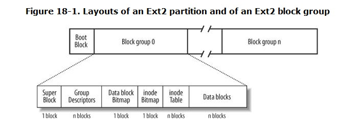

# Chapter 18. The Ext2 and Ext3 Filesystems

## 18.1. General Characteristics of Ext2

## 18.2. Ext2 Disk Data Structures

### 18.2.1. Superblock
+ ext2_super_block structure

### 18.2.2. Group Descriptor and Bitmap
+ ext2_group_desc structure

### 18.2.3. Inode Table
+ consists of a series of consecutive blocks, each of which contains a predefined number of inodes
+ ext2_inode structure

### 18.2.4. Extended Attributes of an Inode

### 18.2.5. Access Control Lists
+ Access control lists were proposed a long time ago to improve the file protection mechanism in Unix filesystems.

### 18.2.6. How Various File Types Use Disk Blocks
| filetype | description      |
| -------- | ---------------- |
| 0        | Unknown          |
| 1        | Regular file     |
| 2        | Directory        |
| 3        | Character device |
| 4        | Block device     |
| 5        | Named pipe       |
| 6        | Socket           |
| 7        | Symbolic link    |
