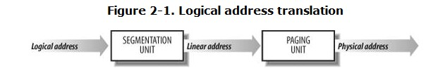
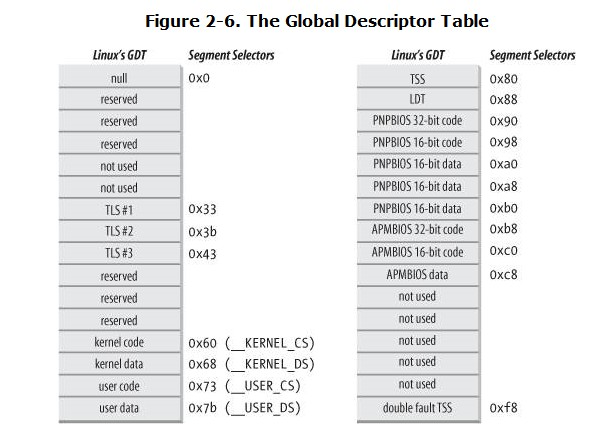
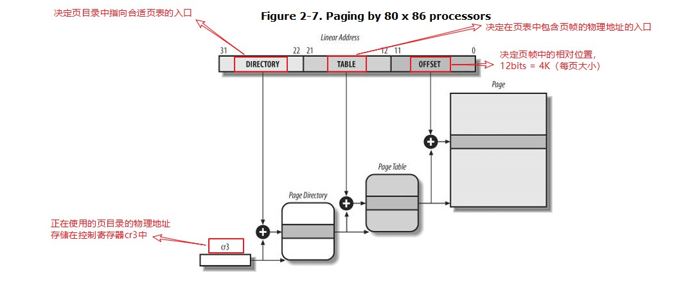
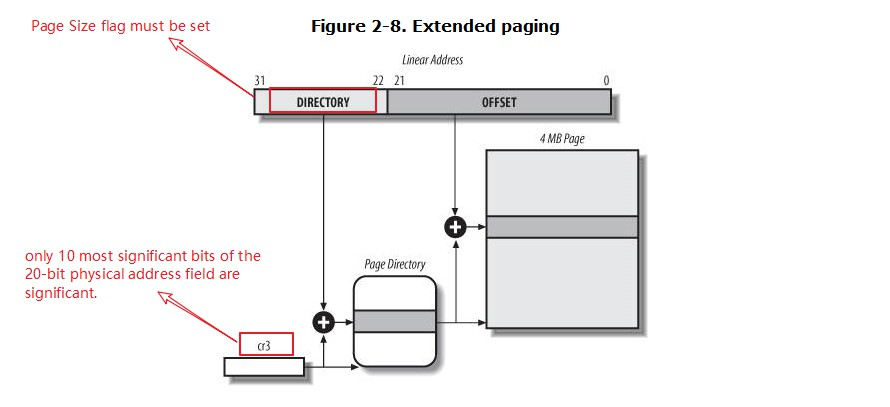
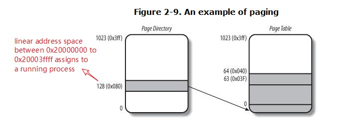
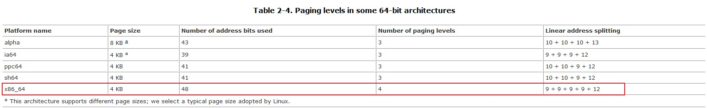
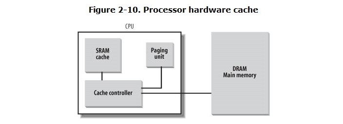
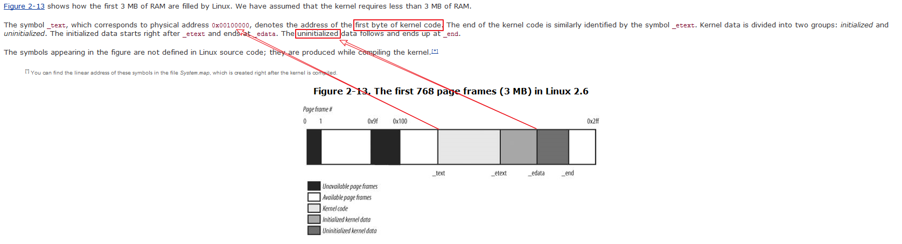

##2.1 memory addresses
### logical address
+ included in the machine language instructions to specify the address of an operand
or of an instruction
+ each logical address consists of a segment and an offset
### linear address
+ known as virtual address
+ usually represented in hexadecimal notation
### physical address
+ used to address memory cells in memory chips




### 2.3.1 the Linux GDT
+ there is one GDT for every CPU in multiprocessor system
+ all GDTs stored in **cpu_gdt_table** array, the addresses and sizes of GDTs are stored in **cpu_gdt_descr** array
+ the layout of GDT is below:


+ Each GDT includes 18 segment descriptors and 14 null, unused, or reserved entries.
+ unused entries are inserted on purpose so that segment descriptors are kept in the same 32-byte line of **hardware cache**
+ The 18 segment descriptors included in each GDT point to the following segments:
* four user and kernel code and data segments
* A task state segment(**TSS**), different for each processor in the system. the TTS are sequentially stored in ***init_tss*** array
* a segment including a default LDT, usually shared by processes
* three thread_local_storage(TLS) segments
* three segments related to Advanced Power Management(**APM**)
* five segments related to PnP BIOS service
* a special TSS segment used by kernel
+ all copies of the GDT store the indentical entries, except for a few cases:
* first: each processor has its **own TSS segment**
* moreover: a few entries in GDT may **depend on the process** that the cpu is executing.
* finally: in some cases, the processor may **temporarily modify an entry** in its copy of GDT

###2.3.2. The Linux LDTs
+ most linux user mode app don't make use of LDT, kernel define a default LDT to be shared by most processors, this default LDT stored in *default_ldt* array, it include five entries, but only two of them are effectively used by the kernel: a **call gate** for iBCS executables and a call gate for x86 executables.
+ ***Call gates*** are a mechanism provided by 80 x 86 microprocessors to change the privilege level of the CPU while invoking a predefined function
+ processes may set up their own LDT in some cases(such ***wine***)

##2.4. Paging in Hardware
+ the paging unit translates linear addresses to physical ones.
+ **key task**: check the requested access type aganist the access rights of linear addresses.
+ for the sake of efficiency, linear addresses are grouped in fixed-length intervals called *pages*
+ The paging unit thinks of all RAM as partitioned into fixed-length *page frames*
+ The data structures that map linear to physical addresses are called *page tables*
+ it is enabled by setting the **PG** flag of a control register named **cr0** . When **PG = 0**, linear addresses are interpreted as physical addresses.

###2.4.1. Regular Paging
+ Starting with the 80386, the paging unit of Intel processors handles **4 KB pages**.
+ the 32-bits linear address are divided into three fields:

| field     | bitsize | meaning                                 |
| --------- | ------- | --------------------------------------- |
| Directory | 10      | signify the Page Directory              |
| Table     | 10      | signify the Page Table                  |
| offset    | 12      | relative position within the page frame |

+ the translation of linear address accomplished in two steps, the aim of this two-level scheme is to reduce the amount of RAM required for per-process **Page-Tables**
+ The two-level scheme reduces the memory by requiring Page Tables **only for those virtual memory regions actually used** by a process.



+ The entries of Page Directories and Page Tables have the same structure, detail pls refer to

###2.4.2. Extended Paging
+ Starting with the Pentium model, 80 x 86 microprocessors introduce extended paging , which allows page frames to be **4 MB** instead of 4 KB in size

+ Extended paging coexists with regular paging; it is enabled by setting the **PSE** flag of the **cr4** processor register.

###2.4.3. Hardware Protection Scheme
+ basically detail informations
###2.4.4. An Example of Regular Paging


###2.4.5. The Physical Address Extension (**PAE**) Paging Mechanism
+ once cr3 is set, it's possible to address up to 4G of RAM.
+ if we want to address more RAM, we'll have to put a **new value in cr3 or change the content of PDPT**.
+ the main problem with PAE is that linear address are still 32-bit long, this force the kernel to reuse the same linear address to map different areas of RAM.
+ PAE does not enlarge the linear address space of a process, because it deals only with linear addresses.
+ only the kernel can modify the page tables of the processes, thus a process running in user mode **can not use a phycial address space larger than 4G**.
+ PAE allows kernel to exploit up to 64G of RAM, thus increase **significantly** the number of processes in the system.
###2.4.6. Paging for 64-bit Architectures


###2.4.7. Hardware Cache
+ Hardware cache memories were introduced to reduce the speed mismatch between CPU and RAM
+ It therefore makes sense to introduce a **smaller and faster memory** that contains the most recently used code and data.
+ a new unit called the ***line*** was introduced into the 80 x 86 architecture.


###2.4.8. Translation Lookaside Buffers (TLB)
+  80x86 processors include another cache called Translation Lookaside Buffers (TLB) **to speed up linear address translation**
+  When a linear address is used for the first time, The physical address is then stored in a TLB entry so that further references to the same linear address can be quickly translated.
+  In a multiprocessor system, each CPU has its own TLB, called the local TLB of the CPU, the corresponding entries of the TLB need not be synchronized
+  When the cr3 control register of a CPU is modified, the hardware automatically invalidates all entries of the local TLB

##2.5. Paging in Linux
+ paging model


+ the automatica translation of linear addresses into physical ones makes the following design objectives feasible:
  + assign a different physical address space to each process, **ensuring an efficent Protection of addressing errors**.
  + distinguish pages(groups of data) from page frames(physical addresses in main memory)

###2.5.1. The Linear Address Fields
+ The following macros simplify Page Table handling:

| macros       | key point                                        | notes                                            |
| ------------ | ------------------------------------------------ | ------------------------------------------------ |
| PAGE_SHIFT   | Specifies the length in bits of the Offset field | used by PAGE_SIZE to return the size of the page |
| PMD_SHIFT    | The total length in bits of the Offset and Table fields of a linear address                                     |                                                  |
| PUD_SHIFT    | Determines the logarithm of the size of the area a Page Upper Directory entry can map                            | **On the 80 x 86 processors**, PUD_SHIFT is always equal to PMD_SHIFT and PUD_SIZE is equal to 4 MB or 2 MB                                                 |
| PGDIR_SHIFT  | Determines the logarithm of the size of the area that a Page Global Directory entry can map                                                 |                                                  |
| PTRS_PER_PTE | Compute the number of entries in the Page Table                                                     | 1,024 when PAE enable, 512 while disable                                                 |
| PTRS_PER_PMD | Compute the number of entries in the Page Middle Directory                                                 | 1 when PAE enable, 512 while disable                                                  |
| PTRS_PER_PUD | Compute the number of entries in the Page Upper Directory                                                 | 1 when PAE enable, 1 while disable                                                  |
| PTRS_PER_PGD | Compute the number of entries in the Page Global Directory                                                 | 1,024 when PAE enable, 4 while disable                                                  |

###2.5.2. Page Table Handling

###2.5.3. Physical Memory Layout
+ The kernel considers the following page frames as reserved :
   + Those falling in the unavailable physical address ranges
   + Those containing the kernel's code and initialized data structures
+ A page contained in a reserved page frame can never be dynamically assigned or swapped to disk.
+ Why isn't the kernel loaded starting with the first available megabyte of RAM?

|                                                                                                                                                     |
| --------------------------------------------------------------------------------------------------------------------------------------------------- |
| *Page frame 0 is used by BIOS to store the system hardware configuration detected during*                                                             |
| *Physical addresses ranging from 0x000a0000 to 0x000fffff are usually reserved to BIOS routines and to map the internal memory of ISA graphics cards* |
| *Additional page frames within the first megabyte may be reserved by specific computer models*                                                                                                                                                    |


###2.5.4. Process Page Tables
+ the linear address space of a process is devided into two parts:

| range                 | mode        | access status |
| --------------------- | ----------- | ------------- |
| 0x00000000~0xbfffffff | USER&KERNEL | YES           |
| 0xc0000000~0xffffffff | KERNEL      | YES           |
| 0xc0000000~0xffffffff | USER        | NO            |

###2.5.5. Kernel Page Tables
+ how the kernel initializes its own page tables ? --- > a two-phase activity
####2.5.5.1. Provisional kernel Page Tables
+ the kernel during its first phase of initialization can address the first 8 MB of RAM by either linear addresses identical to the physical ones or 8 MB worth of linear addresses, starting from 0xc0000000.
####2.5.5.2. Final kernel Page Table when RAM size is less than 896 MB
+ The **__pa** macro is used to convert a linear address starting from PAGE_OFFSET to the corresponding physical address, while the **__va** macro does the reverse.
+ refer to function paging_init in setup.c with 32-bits processor
```
  paravirt_pagetable_setup_start(swapper_pg_dir);
	paging_init();
	paravirt_pagetable_setup_done(swapper_pg_dir);
```
```
/*
 * paging_init() sets up the page tables - note that the first 8MB are
 * already mapped by head.S.
 *
 * This routines also unmaps the page at virtual kernel address 0, so
 * that we can trap those pesky NULL-reference errors in the kernel.
 */
void __init paging_init(void)
{
	pagetable_init();

	__flush_tlb_all();

	kmap_init();

	/*
	 * NOTE: at this point the bootmem allocator is fully available.
	 */
	sparse_init();
	zone_sizes_init();
}
```
####2.5.5.3. Final kernel Page Table when RAM size is between 896 MB and 4096 MB
+ The best Linux can do during the initialization phase is to **map a RAM window of size 896 MB** into the kernel linear address space

####2.5.5.4. Final kernel Page Table when RAM size is more than 4096 MB
+ we deal with cases in which the following happens:
  + The CPU model supports Physical Address Extension (PAE ).
  + The amount of RAM is larger than 4 GB.
  + The kernel is compiled with PAE support.
+ a **three-level paging model** is used.

###2.5.6. Fix-Mapped Linear Addresses
+ a *fix-mapped linear address* is a constant linear address like 0xffffc000 whose corresponding physical address does not have to be the linear address minus 0xc000000, but rather a physical address set in an arbitrary way
+ each fix-mapped linear address maps one page frame of the physical memory
+ a fix-mapped linear address can map **any physical address**, while the mapping established by the linear addresses in the initial portion of the fourth gigabyte **is linear** (linear address X maps physical address X-PAGE_OFFSET).
+ With respect to variable pointers, fix-mapped linear addresses are more efficient
  + 1  dereferencing a variable pointer requires one memory access more than dereferencing an immediate constant address
  + 2  check of variable pointer is never required for a constant linear address.
###2.5.7. Handling the Hardware Cache and the TLB
+ how the kernel makes an optimal use of the hardware caches?

####2.5.7.1. Handling the hardware cache
+ To optimize the cache hit rate, the kernel considers the architecture in making the following decisions:
  + The most frequently used fields of a data structure are placed at the low offset within the data structure, so they can be cached in the same line.
  + When allocating a large set of data structures, the kernel tries to store each of them in memory in such a way that all cache lines are used uniformly.
+ The kernel does provide, however, **cache flushing interfaces** for processors that do not synchronize caches.
####2.5.7.2. Handling the TLB
+ Processors cannot synchronize their own TLB cache automatically because it is the kernel, and not the hardware, that decides when a mapping between a linear and a physical address is no longer valid.
