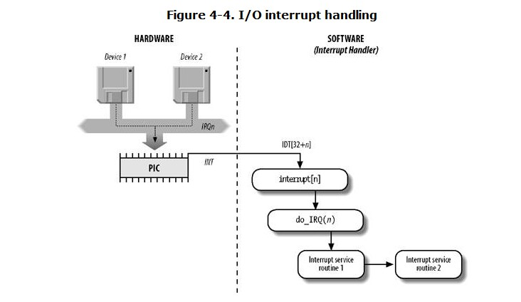

#Chapter 4. Interrupts and Exceptions
+ interrupts are devied into synchronous and asynchronous

##4.1. The Role of Interrupt Signals
+ there is a key difference between interrupt handling and process switching:
+ the code executed by an interrupt or by an exception handler is **not a process**.
+ it is a **kernel control path** that was running when an interrupt occured.
+ the interrupt handler is lighter than a process(less context and requires less time to set up or tear down)
+ interrupt handling must satisfy the following constrains:
+ interrupts can come anytime
+ kernel may handing one of interrups when another one occurs.
+ some crutial regions exist inside the kernel code where interrupts must be disabled.

##4.2. Interrupts and Exceptions
+ Interrupts: nonmaskable and maskable
+ Exceptions:

| type                         | defination                                                                                                          | usage                                                           |
| ---------------------------- | ------------------------------------------------------------------------------------------------------------------- | --------------------------------------------------------------- |
| processor_detected exception | cpu detects an anomalous condition                                                                                  | three groups depending on eip register                       |
| faults                       | the address of instruction cause the fault(the eip register)                                                        |                                                                 |
| traps                        | triggered only when there is no need to reexecute the instruction that terminated                                   | for debugging purpose                                           |
| aborts                       | hardware failure and invalid value in system tables                                                                 | force the affected process to terminated                     |
| programmed exceptions        | occurs at the request of programmer, triggered by int or int3 instructions, often called ***software interrupts***. | to implement system call and notify a debugger a specific event                 |


###4.2.1. IRQs and Interrupts
####4.2.1.1. The Advanced Programmable Interrupt Controller (APIC)

+ The I/O APIC consists of a set of 24 IRQ lines, a 24-entry Interrupt Redirection Table, programmable registers, and a message unit for sending and receiving APIC messages over the APIC bus.
+ interrupt request coming from external HW can be distributed among the available CPUs in two way:
  + static distribution
  + dynamic distribution
+ Interprocessor interrupts (in short, **IPIs**) are a crucial component of the **SMP** architecture. They are actively used by Linux to **exchange messages among CPUs**.
+ uniprocessor systems include an I/O APIC chip --- > configuration:
  + As a standard 8259A-style external PIC connected to the CPU.
  + As a standard external I/O APIC


###4.2.3. Interrupt Descriptor Table(**IDT**)
+ IDT associates each interrupt or exception vector with the address of the corresponding interrupt or exception handler
###4.2.4. Hardware Handling of Interrupts and Exceptions
+ the control unit check whether an interrupt or exception occured while the control unit executed the previous instruction. if one occured, it takes the following action:(step1 ~ step9)
+ relinquish control to the interrupted process by taking step1 ~ step4

##4.3. Nested Execution of Exception and Interrupt Handlers
+ the price to pay for allowing nested kernel control paths is that **an interrupt handler must never block**.no process switch can take place until an interrupt handler is running
+ An interrupt handler may preempt both other interrupt handlers and exception handlers. Conversely, an exception handler never preempts an interrupt handler. The only exception that can be triggered **in Kernel Mode** is "Page Fault".

##4.4. Initializing the Interrupt Descriptor Table
###4.4.1. Interrupt, Trap, and System Gates
###4.4.2. Preliminary Initialization of the IDT

##4.5. Exception Handling
+ when one of them occurs, kernel send a signal to the process which caused the exception
+ Exception handlers have a standard structure consists three steps:
  + save the contents of most registers in the kernel mode stack
  + handle the exception by means of high-level c function
  + exit from the handler by means of **ret_from_exception**
* **what a typical handler does once it was invoked?**
###4.5.1. Saving the Registers for the Exception Handler
```
handler_name:
        pushl $0 /* only for some exceptions */
        pushl $do_handler_name
        jmp error_code
```
+ the code performed the following steps: step1 ~ step7

###4.5.2. Entering and Leaving the Exception Handler

##4.6. Interrupt Handling
+ we'll distinguish three main classes of interrupts

| interrupt type            | useage |
| ------------------------- | ----- |
| I/O interrupts            | the corresponding interrupt handler must query the device to determine the proper course of action      |
| Timer interrupts          | These interrupts are handled mostly as I/O interrupts      |
| Interprocessor interrupts | A CPU issued an interrupt to another CPU of a multiprocessor system       |
|                           |       |
###4.6.1. I/O Interrupt Handling
+ Interrupt handler flexibility is achieved in two distinct ways
  * IRQ sharing
  * IRQ dynamic allocation
+ **Most important**, the process on behalf of which an interrupt handler is executed must always stay in the **TASK_RUNNING** state
+ devide the actions to be performed by the interrupt handler into three classes:

| class                  | actions                                                                               | Role                 | note |
| ---------------------- | ------------------------------------------------------------------------------------- | -------------------- | ---- |
| critical               | acknowledging an interrupt to the PIC; reprogramming the PIC or the device controller | device and processor | with maskable interrupts disabled     |
| noncritical            | updating data structures that are accessed only by the processor                                                                                       |                      | with the interrupts enabled     |
| noncritical deferrable | copying a buffer's contents into the address space of a process                                                                                       |                      | performed by means of separate functions

+ all I/O interrupt handlers perform the same four basic actions
  + 1.save the IRQ value and register's contents on the kernel mode stack
  + 2.send an ack to the PIC that is servicing the IRQ line
  + 3.execute the ISRs associated with all the devices that share the IRQ
  + 4.terminated by jumping to the **ret_from_intr** address


####4.6.1.1. Interrupt vectors
+ refer to **Table 4-2**. Interrupt vectors in Linux

####4.6.1.2. IRQ data structures

+ Each entry n of the interrupt array stores the address of the interrupt handler for IRQ n
```
/*
	 * Cover the whole vector space, no vector can escape
	 * us. (some of these will be overridden and become
	 * 'special' SMP interrupts)
	 */
	for (i =  FIRST_EXTERNAL_VECTOR; i < NR_VECTORS; i++) {
		/* SYSCALL_VECTOR was reserved in trap_init. */
		if (i != SYSCALL_VECTOR)
			set_intr_gate(i, interrupt[i-FIRST_EXTERNAL_VECTOR]);
	}
```
####4.6.1.3. IRQ distribution in multiprocessor systems
+ when a hardware device raises an IRQ signal, the multi-APIC system selects one of the CPUs and delivers the signal to the corresponding local APIC, which in turn interrupts its CPU. **No other CPUs are notified of the event**.

####4.6.1.4. Multiple Kernel Mode stacks

####4.6.1.9. Interrupt service routines
```
/**
 * handle_IRQ_event - irq action chain handler
 * @irq:	the interrupt number
 * @action:	the interrupt action chain for this irq
 *
 * Handles the action chain of an irq event
 */
irqreturn_t handle_IRQ_event(unsigned int irq, struct irqaction *action)
{
	irqreturn_t ret, retval = IRQ_NONE;
	unsigned int status = 0;

	if (!(action->flags & IRQF_DISABLED))
		local_irq_enable_in_hardirq();

	do {
		ret = action->handler(irq, action->dev_id);
		if (ret == IRQ_HANDLED)
			status |= action->flags;
		retval |= ret;
		action = action->next;
	} while (action);

	if (status & IRQF_SAMPLE_RANDOM)
		add_interrupt_randomness(irq);
	local_irq_disable();

	return retval;
}
```

| param  | mean               | note                                                       |
| ------ | ------------------ | ---------------------------------------------------------- |
| irq    | the IRQ number     | allows a single ISR to handle several IRQ lines            |
| dev_id | device idenetifier | allows a single ISR to take care of device of the sme type |
|        |                    |                                                            |

####4.6.1.10. Dynamic allocation of IRQ lines

###4.6.2. Interprocessor Interrupt Handling
+ an interprocessor interrupt (IPI) is delivered not through an IRQ line, but directly **as a message on the bus** that connects the local APIC of all CPUs.
+ On multiprocessor systems, Linux makes use of three kinds of interprocessor interrupts

| type                  | Scenes                                                                                                                                           |
| --------------------- | ------------------------------------------------------------------------------------------------------------------------------------------------ |
| CALL_FUNCTION_VECTOR  | Sent to all CPUs but the sender, forcing those CPUs to run a function passed by the sender                                                       |
| RESCHEDULE_VECTOR     | When a CPU receives this type of interrupt, the corresponding handler named reschedule_interrupt( ) limits itself to acknowledging the interrupt |
| INVALIDATE_TLB_VECTOR | Sent to all CPUs but the sender, forcing them to invalidate their Translation Lookaside Buffers.                                                 |


##4.7. Softirqs and Tasklets
+ the deferrable tasks can execute with all interrupt enable

+ the difference between softirq and tasklet:

| Softirq                                  | tasklet                                                                      |
| ---------------------------------------- | ---------------------------------------------------------------------------- |
|                                          | implement on top of Softirq                                                  |
| staticlly allocated                      | can be allocated at running time                                             |
| concurrently on several CPUs(re-entrant) | same type can't be execute by two CPU at same time(serialized), while different type can(needs not be re-entrant) |
|                                          |                                                                              |
+ Activation and execution are bound together: a deferrable function that has been activated by a given CPU must be executed on the same CPU.
+ Binding the deferrable function to the activating CPU could in theory **make better use of the CPU hardware cache**
###4.7.1. Softirqs
####4.7.1.1. Data structures used for softirqs
+ softirqs used in linux ---> refer to table 4-9
####4.7.1.2. Handling softirqs
+ The open_softirq( ) function takes care of softirq initialization
+ Checks for active (pending) softirqs:
+ When the kernel invokes the local_bh_enable( ) function to enable softirqs on the local CPU
+ When the do_IRQ( ) function finishes handling an I/O interrupt and invokes the irq_exit( ) macro
+ If the system uses an I/O APIC, when the smp_apic_timer_interrupt( ) function finishes handling a local timer interrupt
+ In multiprocessor systems, when a CPU finishes handling a function triggered by a CALL_FUNCTION_VECTOR interprocessor interrupt
+ When one of the special *ksoftirqd/n* kernel threads is awakened

####4.7.1.4. The _ _do_softirq( ) function
+ The _ _do_softirq( ) function reads the softirq bit mask of the local CPU and executes the deferrable functions corresponding to every set bit.
+ _ _do_softirq( ) performs a fixed number of iterations and then returns(not delaying user mode process for a long time)
+ The remaining pending softirqs will be handled in due time by the **ksoftirqd** kernel thread
+ data flow refer to step1~step11

####4.7.1.5. The ksoftirqd kernel threads
+ In recent kernel versions, each CPU has its own ksoftirqd/n kernel thread
+ The ksoftirqd/n kernel threads represent a solution for a critical trade-off problem.
+ The potential for a continuous high-volume flow of softirqs creates a problem:
+ without kernel thread developers faced two alternative strategies:
+ The first strategy consists of ignoring new softirqs that occur while do_softirq( ) is running
--->  softirq latency time is unacceptable for networking developers
+ The second strategy consists of continuously rechecking for pending softirqs
--->  upset normal users of the system

###4.7.2. Tasklets
+ Tasklets are the preferred way to implement deferrable functions in I/O drivers.
+ Notice that, unless the tasklet function reactivates itself, every tasklet activation triggers at most one execution of the tasklet function

##4.8. Work Queues
+ introduced in Linux2.6
+ allow kernel functions to be activated and later executed by special kernel thread called work thread.
+ deferrable functions run in interrupt context, while function in work queue runs in process context.
+ running in process context is the only way to execute functions that can block because no process switch can take place in interrupt context.

###4.8.1. Work queue data structures
+ workqueue_struct

###4.8.2. Work queue functions
+ because work queue function can block, the worker thread can be put to sleep, even migrated
to another CPU when resumed.


###4.8.3. The predefined work queue
+ the kernel offers a predefined work queue called ***events***(eg: kblockd)
+ included functions of different kernel layers and I/O drivers.
+ functions executed in the predefined work queue should not block for a long time: execution of pending functions is serialized on each CPU.

##4.9. Returning from Interrupts and Exceptions
+ to resume the execution of some program, several issues must be considered before doing it.

| things take into consideration         | notes                                          |
| -------------------------------------- | ---------------------------------------------- |
| num of KCP being concurrently executed | cpu switch back to user mode if there just one |
| pending process switch request         | if any, kernel must perform process scheduling; otherwize, return to current process                                               |
| pending Signals                        | if a signal is sent to current process, it must be handled.                                               |
| signal-step mode                       | debugger tracing                                               |
| virtual-8086 Mode                      | handled in a special way                                               |


