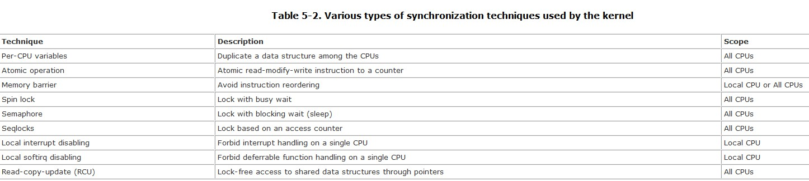
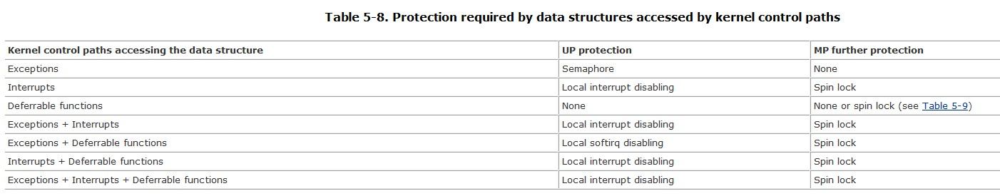

#Chapter 5. Kernel Synchronization
+ parts of kernel not run serially, but in an interleaved way. thus they can give rise
to race conditions which we must controlled through proper Synchronization techniques.

##5.1. How the Kernel Services Requests
+ satisfy two type of requests: those by customer and those by a limited number of boss.
+ the services is in kernel mode, if the cpu is executed in user mode, the waiter is
considered idle.
+ boss requests correspond to interrupts, while customer requests correspond to
system calls or exceptions raised by User Mode processes.

###5.1.1. Kernel Preemption
+ planned process switch --- a process relinquish the cpu, for instance it has to sleep
waiting for some resource.
+ forced process switch --- differ on the way a process reacts to asynchronous events that
could induce a process switch.
+ kernel Preemption is disabled when preemp_count field is greater than zero. and
it happens when the following case occurs.
  + kernel is executing an ISR
  + the deferrable functions are disabled.
  + the kernel Preemption explicitly disabled by setting the counter a positive value.

+ the above rules tell us that kernel can be preempted only when it executing an exception handler and the kernel preemption not been explicitly disabled.
```
/*
 * this is the entry point to schedule() from in-kernel preemption
 * off of preempt_enable. Kernel preemptions off return from interrupt
 * occur there and call schedule directly.
 */
asmlinkage void __sched preempt_schedule(void)
{
	struct thread_info *ti = current_thread_info();

	/*
	 * If there is a non-zero preempt_count or interrupts are disabled,
	 * we do not want to preempt the current task. Just return..
	 */
	if (likely(ti->preempt_count || irqs_disabled()))
		return;

	do {
		add_preempt_count(PREEMPT_ACTIVE);
		schedule();
		sub_preempt_count(PREEMPT_ACTIVE);

		/*
		 * Check again in case we missed a preemption opportunity
		 * between schedule and now.
		 */
		barrier();
	} while (unlikely(test_thread_flag(TIF_NEED_RESCHED)));
}
```
+ kernel preemption introduces a **non-negligible overhead**

###5.1.2. When Synchronization Is Necessary
+ A *critical region* is a section of code that must be completely executed by the kernel control path that enters it before another kernel control path can enter it
+ Once a critical region has been identified, it must be suitably protected to ensure that any time at most one kernel control path is inside that region.

###5.1.3. When Synchronization Is Not Necessary
+ Interrupt handlers and tasklets need not to be coded as reentrant functions.
+ Per-CPU variables accessed by softirqs and tasklets only do not require synchronization.
+ A data structure accessed by only one kind of tasklet does not require synchronization.

##5.2. Synchronization Primitives
+ synchronization techniques


###5.2.1. Per-CPU Variables
+ a per-CPU variable is an array of data structures, one element per each CPU in the system
+ per-CPU variables provide protection against concurrent accesses from several CPUs, do not provide protection against accesses from synchronous functions. in this case, additional synchronization Primitives are required.
+ **rule:** a kernel control path should access a per-cpu variable with kernel preemption disabled.

###5.2.2. Atomic Operations
###5.2.3. Optimization and Memory Barriers
###5.2.4. Spin Locks
####5.2.4.1. The spin_lock macro with kernel preemption
####5.2.4.2. The spin_lock macro without kernel preemption
####5.2.4.3. The spin_unlock macro

###5.2.5. Read/Write Spin Locks
####5.2.5.1. Getting and releasing a lock for reading
####5.2.5.2. Getting and releasing a lock for writing

###5.2.6. Seqlocks
+ Seqlocks introduced in Linux 2.6 are similar to read/write spin locks, except that they give a **much higher priority** to writers
+ **Notice** that when a reader enters a critical region, it does not need to disable kernel preemption; on the other hand, the writer automatically disables kernel preemption when entering the critical region, because it acquires the spin lock.

###5.2.7. Read-Copy Update (RCU)
+ designed to protect data structures that are mostly accessed for reading by several CPUs.
+ How does RCU obtain the surprising result of synchronizing several CPUs without shared data structures?
  + 1 Only data structures that are dynamically allocated and referenced by means of pointers can be protected by RCU. RCU只用于保护动态分配或通过指针引用的数据结构。
  + 2 No kernel control path can sleep inside a critical region protected by RCU. 内核控制路径不能睡眠于由RCU保护的原子区。
+ The old copy can be freed only after all (potential) readers on the CPUs have executed the rcu_read_unlock( ) macro.旧的copy只能在所有读取者执行XX宏之后才能被释放。
+ RCU is a new addition in Linux 2.6; it is used in the networking layer and in the Virtual Filesystem.

###5.2.8. Semaphores
+ Essentially, they implement a locking primitive that allows waiters to sleep until the desired resource becomes free.
+ linux offers two kinds of Semaphores:
+ kernel Semaphores used by kernel control paths.
+ System V IPC Semaphores, which are used by user mode processes.
+ kernel semaphores can be acquired only by functions that are allowed to sleep; interrupt handlers and deferrable functions cannot use them.只有允许睡眠的函数才能获得内核信号量， 中断和可延迟函数不能使用它。
+ main task of the _ _down( ) function is to suspend the current process *until* the semaphore is released
+ Only exception handlers , and particularly system call service routines , can use the down( ) function. 只有系统调用（异常），可以调用down

###5.2.9. Read/Write Semaphores
+ Read/write semaphores improve the amount of concurrency inside the kernel and improve overall system performance. 提升内核并发的数量和系统整体性能

###5.2.10. Completions
+ They have been introduced to solve a **subtle race condition** that occurs in multiprocessor systems
+ The real difference between completions and semaphores is how the spin lock included in the wait queue is used

| type       | differ |
| ---------- | ------ |
| completion | the spin lock is used to ensure that complete( ) and wait_for_completion( ) cannot execute concurrently       |
| semaphore  | the spin lock is used to avoid letting concurrent down( )'s functions mess up the semaphore data structure       |

###5.2.11. Local Interrupt Disabling
+ used to ensure that a sequence of kernel statements is treated as a critical section
+ local interrupt disabling does not protect against concurrent accesses to data structures by interrupt handlers running on other CPUs.禁止本地中断，不能防止运行在其它CPU上的中断对数据结构的并发访问。

###5.2.12. Disabling and Enabling Deferrable Functions

##5.3. Synchronizing Accesses to Kernel Data Structures
+ the following rule of thumb is adopted by kernel developers: *always keep the concurrency level as high as possible in the system*.
+ spin locks have negative effects on the overall performance of the system because of their impact on the **hardware caches**.

###5.3.1. Choosing Among Spin Locks, Semaphores, and Interrupt Disabling


####5.3.1.1. Protecting a data structure accessed by exceptions
+ data structure accessed only by exception usually represent a *resource* that can assigned to one or more process.
+ race conditions are avoided through semaphores(allow process sleep)
+ The only case in which kernel preemption must be explicitly disabled is when accessing per-CPU variables

####5.3.1.2. Protecting a data structure accessed by interrupts
+ in uniprocessor system, race condition must be avoided by disabling interrupts(semaphore will make other process sleep; spin lock will free the system---打断当前中断的其它中断将因无法获取到spin lock而进入忙等状态，直到获得spin lock)
+ in multiprocessor system, the most convenient method to prevent race condition is to disable local interrupt and acquire a spin lock.

####5.3.1.3. Protecting a data structure accessed by deferrable functions
+ in multiprocessor systems, race conditions do exist because several deferrable functions may run concurrently

| deferrable functions accessing data struct | protection |
| ------------------------------------------ | ---------- |
| softirqs                                   | spin lock  |
| one tasklet                                | none       |
| many tasklets                              | spin lock  |

+ A data structure accessed by a softirq must always be protected, usually by means of a spin lock, because the same softirq may run concurrently on two or more CPUs. Conversely, a data structure accessed by just one kind of tasklet need not be protected, because tasklets of the same kind cannot run concurrently. However, if the data structure is accessed by several kinds of tasklets, then it must be protected.
+ 同一种软中断不能在多个cpu上并发执行，相反，某种类型的tasklet访问的data struct不需要保护（不能在多个cpu上并发执行），但是多种访问同一种data struct的tasklets需要被保护。

####5.3.1.4. Protecting a data structure accessed by exceptions and interrupts
+ On uniprocessor systems，interrupt handlers are not reentrant and cannot be interrupted by exceptions.
+ 中断处理程序不可以重入，不能被异常中断。
+ On multiprocessor systems，Local interrupt disabling must be coupled with a spin lock
+ 多处理器系统上，禁止本地中断必须和自旋锁成对出现。

####5.3.1.5. Protecting a data structure accessed by exceptions and deferrable functions
+ can be treated like a data structure accessed by exception and interrupt handlers
+ no exception can be raised while a deferrable function is running
+ 可延迟函数正在运行时不允许产生异常。
+ Execution of deferrable functions on each CPU is serialized, so no race condition exists

####5.3.1.6. Protecting a data structure accessed by interrupts and deferrable functions
+ similar to that of a data structure accessed by interrupt and exception handlers
+ an interrupt handler can freely touch the data structure accessed by the deferrable function without disabling interrupts

####5.3.1.7. Protecting a data structure accessed by exceptions, interrupts, and deferrable functions
+ there is no need to explicitly disable deferrable functions, because they are essentially activated when terminating the execution of interrupt handlers; disabling local interrupts is therefore sufficient.
