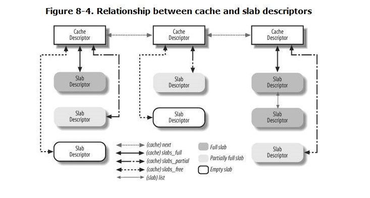

##8.1. Page Frame Management
+ Linux adopts the smaller 4 KB page frame size as the standard memory allocation unit.

###8.1.1. Page Descriptors
+ the kernel must keep track of cur state of each page frame.
+ state info kept in page descriptor of type **page**

###8.1.2. Non-Uniform Memory Access (NUMA) --- 非对齐内存访问
+ physical memory partitioned into several different *nodes*
+ physical memory inside each node splited into several *zones*

###8.1.3. Memory Zones
+ two hardware constraints

| DMA processor for old ISA buses | 32-bit computers with lots of RAM |
| ------------------------------- | --------------------------------- |
| only first 16M of RAM           | not directly access all RAM       |

+ kernel 2.6 partition every memory node to three zones
  + ZONE_DMA --- below 16M
  + ZONE_NORMAL --- 16 ~ 896M
  + ZONE_HIGHMEM --- above 896M

###8.1.4. The Pool of Reserved Page Frames
+ memory allocation request in two different ways:
  + request immediately satisfied.
  + request is blocked until additional memory has been reclaimed.
+ some kernel control paths use atmoic request(never blocked)
  + kernel reserve a memory pool of page frame for atmoic memory allocation request
  + reserved pool size = \sqrt{16*directly mapped memory}

###8.1.5. The Zoned Page Frame Allocator
+ requests for groups of contiguous page frames is called the *zoned page frame allocator*

+ The node_zonelists field of the contig_page_data node descriptor is an array of lists of zone descriptors representing the *fallback zones*: include the memory zone that could be used in case of original zone is short.

###8.1.6. Kernel Mappings of High-Memory Page Frames
+ Page frames above the 896 MB boundary are not generally mapped in the fourth gigabyte of the kernel linear address spaces, so the kernel is unable to directly access them. 页分配器对高内存页无效。
+ On 32-bit platforms such as the 80 x 86 architecture
  + The allocation of high-memory page frames is done only through the alloc_pages( ) function and its alloc_page( ) shortcut. 只能由alloc_page或alloc_pages来分配高内存页。
  + Page frames in high memory that do not have a linear address cannot be accessed by the kernel.
  没有虚拟地址的高内存页不能被kernel访问。

+ three different mechanisms to map page frames in high memory

####8.1.6.1. Permanent kernel mappings
####8.1.6.2. Temporary kernel mappings
+ can be used inside interrupt handlers and deferrable functions, because requesting a temporary kernel mapping never blocks the current process.

###8.1.7. The Buddy System Algorithm
+ The technique adopted by Linux to solve the *external fragmentation* problem is based on the well-known *buddy system algorithm*.

###8.1.8. The Per-CPU Page Frame Cache
+ To boost system performance, each memory zone defines a per-CPU page frame cache. Each per-CPU cache includes some pre-allocated page frames to be used for single memory requests issued by the local CPU.

####8.1.8.1. Allocating page frames through the per-CPU page frame caches

####8.1.8.2. Releasing page frames to the per-CPU page frame caches

###8.1.9. The Zone Allocator
+ The zone allocator also takes care of releasing page frames; thankfully, releasing memory is a lot easier than allocating it.

##8.2. Memory Area Management
+ how are we going to deal with requests for small memory areas？
+ the problem of *internal fragmentation* --- caused by a mismatch between the size of the memory request and the size of the memory area allocated to satisfy the request. 请求和实际分配大小不匹配。

###8.2.1. The Slab Allocator
+ The slab allocator groups objects into *caches* . Each cache is a "store" of objects of the same type.
+ The area of main memory that contains a cache is divided into *slabs* ; each slab consists of one or more contiguous page frames that contain both allocated and free objects

###8.2.2. Cache Descriptor

###8.2.3. Slab Descriptor
+ Slab descriptors can be stored in two possible places:
  +  External slab descriptor
  +  Internal slab descriptor

###8.2.4. General and Specific Caches
+ Caches are divided into two types: general and specific. *General caches* are used only by the slab allocator for its own purposes, while *specific caches* are used by the remaining parts of the kernel.

###8.2.5. Interfacing the Slab Allocator with the Zoned Page Frame Allocator
+ When the slab allocator creates a new slab, it **relies on** the zoned page frame allocator to obtain a group of free contiguous page frames.

###8.2.6. Allocating a Slab to a Cache
+ A newly created cache does not contain a slab and therefore does not contain any free objects. New slabs are assigned to a cache only when **both** of the following are true:
  + A request has been issued to allocate a new object.
  + The cache does not include a free object.

####8.2.7. Releasing a Slab from a Cache
+ Slabs can be destroyed in two cases:
  + There are too many free objects in the slab cache
  + A **timer** function invoked periodically determines that there are fully unused slabs that can be released

###8.2.8. Object Descriptor

###8.2.9. Aligning Objects in Memory
+ The largest ***alignment factor*** allowed by the slab allocator is 4,096the page frame size.

###8.2.10. Slab Coloring
+  different arbitrary values called *colors* are assigned to the slabs.
+  total length in bytes of a slab --- > *slab length = (num x osize) + dsize+ free*
+  The slab allocator takes advantage of the free unused bytes to color the slab. The term "color" is used simply to subdivide the slabs and allow the memory allocator to spread objects out among different linear addresses. --- > kernel obtain the best performance of microprocessor's hardware cache.
+  Coloring works only when free is large enough.

###8.2.11. Local Caches of Free Slab Objects
+  Linux 2.6 implementation of the slab allocator for multiprocessor

###8.2.12. Allocating a Slab Object
+ kmem_cache_alloc

###8.2.13. Freeing a Slab Object
+ kmem_cache_free

###8.2.14. General Purpose Objects
+ Objects of this type are obtained by invoking the kmalloc( ) function

###8.2.15. Memory Pools
+ Memory pools are a new feature of Linux 2.6
+ allows a kernel component to allocate some dynamic memory to be used **only in** low-on-memory emergencies.

##8.3. Noncontiguous Memory Area Management
+ the size of a noncontiguous memory area must be a multiple of 4,096.
+ Linux uses noncontiguous memory areas in several ways

###8.3.1. Linear Addresses of Noncontiguous Memory Areas

###8.3.2. Descriptors of Noncontiguous Memory Areas
+ descriptor of type *vm_struct*

###8.3.3. Allocating a Noncontiguous Memory Area
+ vmalloc( ) --- > returns the initial linear address of the new area

###8.3.4. Releasing a Noncontiguous Memory Area
+ vfree( )
