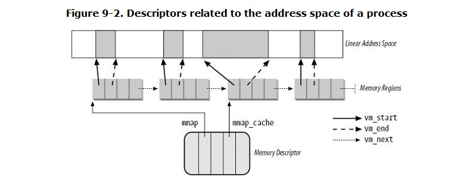

#Chapter 9. Process Address Space
+ the kernel succeeds in deferring the allocation of dynamic memory to processes by using a new kind of resource ---> 通过一种新资源来延迟分配 "memory region"
+ The kernel represents intervals of linear addresses by means of resources called *memory regions*

##9.1. The Process's Address Space
+ there are typically situations in which process get new memory regions.
+ essentially for kernel to identify the memory regions currently owned by the process ---> enable page fault exception handler to efficiently distinguish two type of invalid linear address.
  + programming error
  + missing page

##9.2. The Memory Descriptor
+ type of *mm_struct*

###9.2.1. Memory Descriptor of Kernel Threads
+ every time a high linear address has to be remapped (typically by vmalloc( ) or vfree( )), the kernel updates a canonical set of Page Tables rooted at the *swapper_pg_dir* master kernel Page Global Directory

##9.3. Memory Regions
+ type vm_area_struct

###9.3.1. Memory Region Data Structures

+ In general, the red-black tree is used to locate a region including a specific address, while the linked list is mostly useful when scanning the whole set of regions.

###9.3.2. Memory Region Access Rights
+ We now introduce a third kind of flag: those associated with the pages of a memory region. They are stored in the vm_flags field of the vm_area_struct descriptor
+ translating the memory region's access rights into the page protection bits is not straightforward

###9.3.3. Memory Region Handling

####9.3.3.1. Finding the closest region to a given address: find_vma( )

####9.3.3.2. Finding a region that overlaps a given interval: find_vma_intersection( )
+ finds the first memory region that overlaps a given linear address interval

####9.3.3.3. Finding a free interval: get_unmapped_area( )
+ searches the process address space to find an available linear address interval

####9.3.3.4. Inserting a region in the memory descriptor list: insert_vm_struct( )

###9.3.4. Allocating a Linear Address Interval
+ how new linear address intervals are allocated --->  do_mmap( ), much details to know

###9.3.5. Releasing a Linear Address Interval
+ uses the do_munmap( ) function

####9.3.5.1. The do_munmap( ) function
+ through two main phases
+ In the first phase (steps 16), it scans the list of memory regions owned by the process and unlinks all regions included in the linear address interval from the process address space ---> 扫描进程内存区域链表，从进程地址空间解除包含在线性间隔内的内存区域。
+ In the second phase (steps 712), the function updates the process Page Tables and removes the memory regions identified in the first phase. ---> 更新进程页表，移除第一阶段的内存区域。

####9.3.5.2. The split_vma( ) function
+ to split a memory region that intersects a linear address interval into two smaller regions, one outside of the interval and the other inside.

####9.3.5.3. The unmap_region( ) function
+ walks through a list of memory regions and releases the page frames belonging to them.

##9.4. Page Fault Exception Handler
+ entry: do_page_fault( ) function

###9.4.1. Handling a Faulty Address Outside the Address Space
+ address does not belong to the process address space

###9.4.2. Handling a Faulty Address Inside the Address Space
+ address belongs to the process address space

###9.4.3. Demand Paging
+ The term demand paging denotes **a dynamic memory allocation technique** that consists of deferring page frame allocation until the last possible momentuntil the process attempts to address a page that is not present in RAM, thus causing a Page Fault exception.
+ preferable to global allocation, because it increases the average number of free page frames in the system and therefore allows better use of the available free memory.

###9.4.4. Copy On Write
+ The idea is quite simple: instead of duplicating page frames, they are shared between the parent and the child process.
+ Whenever the parent or the child process attempts to write into a shared page frame, an exception occurs. At this point, the kernel duplicates the page into a new page frame that it marks as writable.

###9.4.5. Handling Noncontiguous Memory Area Accesses

##9.5. Creating and Deleting a Process Address Space

###9.5.1. Creating a Process Address Space
+ copy_mm( )

###9.5.2. Deleting a Process Address Space
+ exit_mm( )

##9.6. Managing the Heap
+ The *start_brk* and *brk* fields of the memory descriptor delimit the starting and ending addresses
